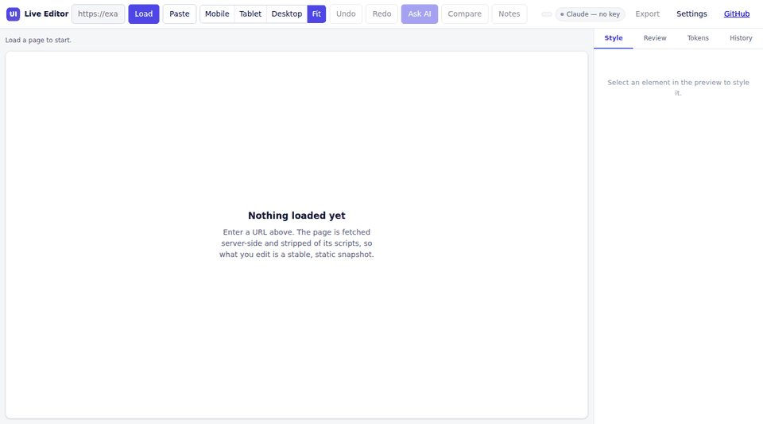

# AI UI Live Editor

**Redline and redesign any live website — with AI, a colour picker, and an accessibility audit that costs nothing to run.**

Load any URL. Click any element. Describe the change in plain language, or nudge
it with a slider. Undo anything. Export real CSS to hand a developer.

[](https://github.com/sina-nasiri/ai-ui-live-editor/actions/workflows/ci.yml)




---

## Why this exists

Design tools show you what a change *would* look like. This shows you what it
*does* look like — on the real page, with the real content, at the real
breakpoint, in about four seconds.

- **Test an idea on production** without a branch, a build, or a developer.
- **Show a stakeholder the actual change**, not a mockup that "will look like this".
- **Audit any page for accessibility** in one click, offline and free.
- **Hand a developer clean CSS**, not a screenshot and a paragraph of hoping.

Works with **Claude, OpenAI, or Gemini** — pick a provider in Settings, or
configure a key server-side so it never touches a browser.

---

## Install

```bash
git clone https://github.com/sina-nasiri/ai-ui-live-editor.git
cd ai-ui-live-editor
composer setup
php artisan serve
```

Open <http://localhost:8000>. That is the whole install — **no database, no
Node, no build step.**

Add an API key in Settings, or put one in `.env` so the browser never sees it:

```env
ANTHROPIC_API_KEY=sk-ant-...     # or OPENAI_API_KEY / GEMINI_API_KEY
```

Requirements: PHP 8.2+ with `dom`, `libxml`, `mbstring`, and Composer.

---

## What it does

### Edit

| | |
|---|---|
| **Ask AI** | Select an element, describe the change. Returns CSS, applies instantly. |
| **Inspector** | Colour, size, weight, spacing, radius, alignment — direct manipulation, no API call, no cost. |
| **Edit text in place** | Click and type. Lands in the same undo history. |
| **Give me 3 options** | Three genuinely different directions, previewed in place, apply the one you want. |
| **Accept or reject each change** | An AI edit is a list, not a lump. Untick the one heading it got wrong and keep the rest. |
| **Refine in place** | "No, less rounded" works — each element keeps its own conversation, so the model knows what "less" refers to. |
| **Rewrite markup** | For the rare case where the structure itself has to change. |
| **Undo / redo** | `Cmd/Ctrl+Z`. Every edit, every time. |
| **Right-click anything** | Ask AI, critique, copy HTML, screenshot, pin a note, select parent. |
| **Cancel** | Every AI request shows elapsed time and can be stopped. |

### Review

| | |
|---|---|
| **Accessibility audit** | WCAG contrast ratios, missing alt text, heading order, unlabelled fields, tap-target size, positive tabindex, missing `lang`. Runs in your browser — **no API key, no cost, no data leaves the page.** Exports as Markdown. |
| **AI design critique** | Read-only feedback on hierarchy, contrast, spacing rhythm, copy clarity, and CTA prominence. Changes nothing, so there is nothing to undo. |
| **Design tokens** | The palette, type scale, spacing scale and radii the page actually ships. Export as CSS custom properties. |
| **Redline notes** | Pin numbered comments to elements and export them as Markdown. They change nothing, so they survive every edit around them. |
| **Before / after** | Drag a handle across the page to reveal the original underneath. |

### Ship

| | |
|---|---|
| **Copy CSS changes** | Real selectors, merged, ready for a pull request. |
| **Download edited page** | Self-contained HTML for review or a deck. |
| **Screenshot to PNG** | Any element, with its images and web fonts embedded. |
| **Copy element HTML** | Clean markup, no editor artefacts. |
| **Viewport presets** | 375 / 768 / 1280 / fit. |
| **Session restore** | Refresh and your edits — styles, copy changes and notes — are still there. |
| **Cost meter** | Real token counts and spend for the session, from the provider's own numbers. |

### Keyboard

| Key | Action |
|---|---|
| `Cmd/Ctrl + K` | Ask AI about the selection |
| `Cmd/Ctrl + Z` | Undo |
| `Cmd/Ctrl + Shift + Z` | Redo |
| `Alt + ↑ / ↓` | Select parent / first child |
| `Alt + ← / →` | Previous / next sibling |
| `Esc` | Deselect |

Clicking usually lands on a `<span>` when you meant the `<section>`. The
breadcrumb in the status bar and `Alt + ↑` are how you get there.

---

## Workflows

**Competitive analysis.** Load a competitor. Extract their design tokens.
Extract yours. Compare the two side by side, and copy the section you want to
try on your own site.

**Preference testing.** Select the CTA → *"Give me 3 options"* → screenshot each
→ put them in front of five people.

**Accessibility triage.** Load the page → Run audit → Copy report → paste into
the ticket. Zero API cost, so run it on every page.

**Design handoff.** Make the changes → Export → Copy CSS changes → attach to the
issue. The developer gets declarations against real selectors, not a screenshot.

**Stakeholder review.** Make the change on the live page → Download edited page
→ email the HTML file.

---

## How it works

```
Browser ──▶ POST /proxy ──▶ UrlGuard      (blocks private networks, every redirect hop)
        or  POST /import   PageSnapshot   (strips scripts, absolutises URLs)
                             │
                             ├─▶ stylesheets rewritten to GET /asset ──▶ same-origin
                             ▼
                    Static snapshot in an iframe
                             │
    click ──▶ outline (~300 tokens) ──▶ POST /ai/edit ──▶ Claude / OpenAI / Gemini
                             │                                    │
                             ▼                                    ▼
                    patch stack in the browser  ◀───  { changes: [{ id, declarations }] }
                             │
                             ├─▶ one stylesheet in the preview
                             ├─▶ undo / redo, accept / reject
                             ├─▶ before/after, PNG capture
                             └─▶ CSS export
```

Two decisions drive everything:

**The page is a static snapshot.** Scripts are stripped server-side. That is a
security requirement — the preview is same-origin, so a script from a loaded
site could otherwise read this app's storage — and it happens to fix
reliability too: no SPA re-hydration wiping your edits, no cookie banner
reappearing, no site JavaScript fighting your clicks.

**An edit is data, not a DOM mutation.** The model receives a compact *outline*
of the selection — element ids, text, and the styles that matter — and returns a
list of CSS declarations keyed to those ids. Compared to round-tripping raw
HTML, that is roughly an order of magnitude fewer tokens, it makes it impossible
for the model to delete your copy, and it means undo is popping a stack, export
is serialising it, before/after is rendering without it, and accept/reject is
flipping one entry in it.

**Sub-resources are relayed, not linked.** A cross-origin stylesheet is
readable by the browser but not by script — `sheet.cssRules` throws. That one
restriction blocks reading a site's design tokens, finding its `@font-face`
sources, and capturing an element to PNG without tainting the canvas. Routing
stylesheets through `/asset` makes them same-origin and removes all three
limits at once. It also renders pages whose CDN refuses the server's request.

---

## Configuration

Everything lives in `.env` and `config/editor.php`.

### Providers

```env
ANTHROPIC_API_KEY=          # blank → each visitor supplies their own key
ANTHROPIC_MODEL=claude-opus-5
ANTHROPIC_EFFORT=medium

OPENAI_API_KEY=
OPENAI_MODEL=gpt-5

GEMINI_API_KEY=
GEMINI_MODEL=gemini-2.5-pro

EDITOR_DEFAULT_PROVIDER=anthropic
EDITOR_ALLOW_CLIENT_KEYS=true   # false → only the server keys above may be used
```

Model lists are plain config — edit `config/editor.php` to add one, no PHP
required.

### Proxy safety

```env
EDITOR_VERIFY_SSL=true              # leave this on
EDITOR_ALLOW_PRIVATE_NETWORKS=false # true lets you edit localhost — see below
EDITOR_ALLOWED_HOSTS=               # comma-separated allow-list
EDITOR_PROXY_CACHE_TTL=300
```

**Editing a local dev server** needs `EDITOR_ALLOW_PRIVATE_NETWORKS=true`. That
switch disables the SSRF guard, so only set it on a machine nobody else can
reach.

**Exposing an instance publicly** means anyone can make your server fetch any
URL. Set `EDITOR_ALLOWED_HOSTS`, keep the rate limits, and read
[SECURITY.md](SECURITY.md) first.

---

## Deployment

Point your web server at `public/` and make `storage/` and `bootstrap/cache/`
writable. There is no database and no asset pipeline, so there is nothing else
to do.

A full walkthrough — Nginx config, Ubuntu packages — is in
[SPONSORS.md](SPONSORS.md#deploying-on-a-fresh-ubuntu-vps).

---

## Troubleshooting

**"That page could not be loaded."** Some sites block server-side requests
outright (Cloudflare bot protection especially). Nothing to fix locally — try
another site.

**The page looks unstyled.** Its stylesheet is probably behind a CDN that
rejects the request. Layout still works; colours may not.

**The page looks different from the real one.** Scripts are stripped by design,
so anything rendered client-side will not appear. That is the trade for a
stable, editable snapshot.

**"That address is on a private or reserved network."** Working as intended —
see `EDITOR_ALLOW_PRIVATE_NETWORKS` above.

**"The reply was cut off."** Select a smaller element. The outline for a whole
`<body>` is large; a section is not.

**Elements are hard to click.** Click roughly, then walk up with the breadcrumb
or `Alt + ↑`.

---

## Limitations — read before you file a bug

- **JavaScript-rendered content will not appear.** Deliberate — scripts are
  stripped. If a site renders everything client-side you will get an empty
  shell; use **Paste** with the DOM copied from DevTools instead.
- **Screenshots fall back on unreachable fonts.** Images and `@font-face`
  sources are fetched through the app's own relay and embedded, so the canvas
  is never tainted. A font the relay cannot fetch falls back to a system face,
  and the toast says so rather than pretending otherwise.
- **Automated accessibility checks catch roughly a third of WCAG.** They are a
  first pass, not a certificate.
- **Session restore matches elements by document order.** If the page changed
  since you saved, edits whose target has moved are dropped and reported, not
  guessed at.
- **Edits are not saved to the site.** This is a sandbox. Nothing you do here
  touches the page you loaded.

## Use it on sites you have permission to test

This tool fetches and modifies third-party pages locally. It changes nothing on
the origin server, but scraping and reproducing pages can still run into terms
of service and copyright. Use it on sites you own, sites you have permission to
test, or public pages for legitimate research and analysis. You are responsible
for how you use it.

---

## Roadmap

- [x] Element screenshots
- [x] Paste-HTML / upload-file mode
- [x] Annotation and redline mode with exportable notes
- [x] Before/after comparison
- [x] Per-change accept/reject
- [x] Cost and token metering
- [ ] Browser extension — no proxy, no CORS, works on pages you are logged into
- [ ] Multi-page projects and shareable review links

**Not planned: token streaming.** It sounds like the fix for latency, but the
model returns a JSON patch, and half a JSON patch is not something you can
render or apply — there is nothing useful to show mid-flight. The actual
complaint was a spinner with no feedback and no way out, so requests now show
elapsed time and can be cancelled. If someone finds a workload where streaming
genuinely helps, the provider layer is the right place for it.

## Contributing

See [CONTRIBUTING.md](CONTRIBUTING.md). Good first issues: new checks in
`audit.js` (pure client-side, no API cost) and better handling of real-world
markup in `PageSnapshot`.

## Built with

[Laravel](https://laravel.com) · [Claude](https://claude.com) ·
[OpenAI](https://openai.com) · [Gemini](https://ai.google.dev) ·
hosting sponsored by [MonoVM](https://monovm.com)

## License

MIT — see [LICENSE](LICENSE).

Built by [Sina Nasiri](https://github.com/sina-nasiri).
